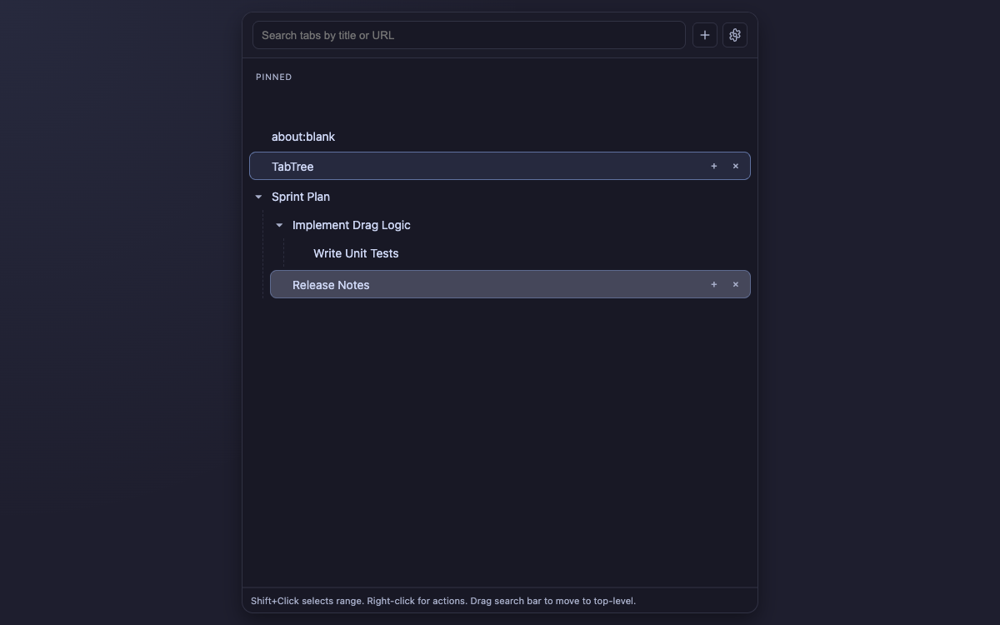
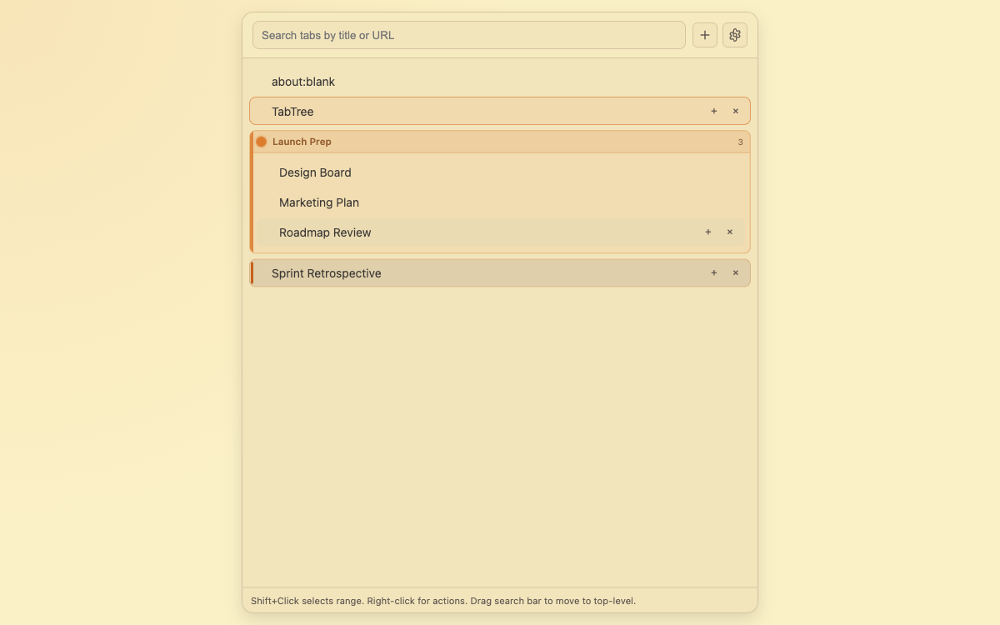
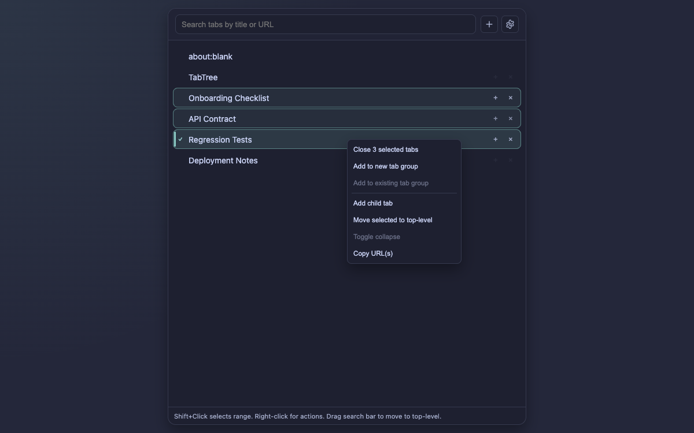
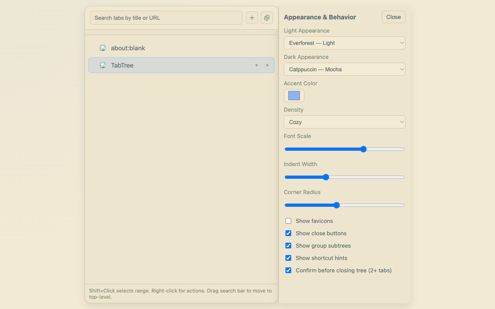

# TabTree

Tree-style vertical tabs for Chrome Side Panel that help you organize browsing into parent/child hierarchies, groups, and batch actions.

## At a Glance

- Chrome extension (Manifest V3) side panel UI
- Tree model for tab relationships (parent, child, collapse/expand)
- Multi-select with Shift-click and batch operations
- Tab group-aware rendering with rename/color support
- Pinned tabs shown in a dedicated horizontal strip
- Appearance and behavior settings synced via `chrome.storage.sync`
- Per-window heavy tree state stored in `chrome.storage.local`

## Screenshots

| Tree Overview (Dark) | Grouped Tabs (Light) |
| --- | --- |
|  |  |
| *Nested tab hierarchy with pinned strip and collapse controls.* | *Color-coded group subtree with group naming and grouping workflow.* |

| Multi-select + Batch Actions (Dark) | Settings + Theme Controls (Light) |
| --- | --- |
|  |  |
| *Range selection plus context menu actions for bulk operations.* | *Appearance and behavior controls including presets, density, and sizing.* |

## Why TabTree

- Keep related work together by nesting tabs under parent tasks.
- Reduce tab clutter with fast drag/drop and batch actions.
- Work naturally with Chrome tab groups instead of fighting them.
- Keep your visual setup consistent across devices through sync-backed settings.

## Install in Chrome

### Requirements

- Chrome `140+` (from `manifest.json`)

### Steps

1. Open `chrome://extensions`.
2. Enable **Developer mode**.
3. Click **Load unpacked** and select this repository folder.
4. Pin the extension and open TabTree from the toolbar.
5. (Optional) Configure shortcuts at `chrome://extensions/shortcuts`.

## Quickstart Workflows

### 1. Create a child tab under the active tab

1. Focus the tab you want to be the parent.
2. Use the add-child action (button in side panel or shortcut if configured).
3. The new tab is created as that tab's child in the tree.

### 2. Reorganize tabs with drag and drop

1. Drag a row to move it `inside`, `before`, or `after` another row.
2. Drag to the search row area to move tabs to top-level.
3. Group and pin constraints are enforced automatically (for example, pinned and unpinned zones stay separate).

### 3. Use multi-select and batch actions

1. Click one tab row, then `Shift+Click` another to select a range.
2. Right-click selected rows for batch actions like close, group, and move-to-root.
3. A close confirmation appears for actions that affect 2+ tabs unless you disable it in settings.

### 4. Work with tab groups

1. Select tabs and choose **Add to new tab group** (or existing group) from context menu.
2. Right-click a group header to rename the group or change color.
3. Collapse/expand group sections from the group header.

### 5. Tune appearance

1. Open **Settings** from the side panel.
2. Pick independent Light/Dark presets and accent color.
3. Adjust density, font scale, indent width, and corner radius.

## Shortcuts and Commands

Configure all shortcuts at `chrome://extensions/shortcuts`.

| Command ID | Action | Default key |
| --- | --- | --- |
| `add-child-tab` | Add a child tab under the active tab | Not set by default |
| `focus-side-panel` | Focus TabTree side panel | `Ctrl+Shift+Y` (Windows/Linux), `Command+Shift+Y` (macOS) |
| `promote-tab-level` | Promote active tab one tree level | Not set by default |
| `toggle-collapse-node` | Toggle collapse for active tab node | Not set by default |
| `move-tab-under-previous-sibling` | Reparent active tab under previous root sibling | Not set by default |

## Settings and Data Sync

- `chrome.storage.sync`: Appearance and behavior settings plus a lightweight metadata snapshot
- `chrome.storage.local`: Per-window heavy tree state

## Behavior Notes

- Parent-close behavior promotes children when needed.
- Grouped tabs render as group subtrees with group name and color.
- Pinned tabs render in a separate horizontal strip.
- Restore is best-effort based on URL/opener relationships and stored metadata.
- Cross-device behavior is metadata sync only; tabs are not auto-opened remotely.

## Troubleshooting

### Side panel is not showing

- Reopen TabTree from the extension action.
- Reload the extension in `chrome://extensions` after manifest or service worker changes.

### Shortcut does not trigger

- Open `chrome://extensions/shortcuts` and check for conflicts.
- Assign a custom key if the command has no default binding.

### Theme or settings seem stale

- Toggle the setting once, then reopen the side panel.
- If still stale, reload the extension to restart the service worker and UI.

### Drag/drop does not behave as expected

- Confirm source and target are both pinned or both unpinned.
- Use the search row drop target to explicitly move tabs back to top-level.

## For Contributors

### Project Layout

- `manifest.json`: extension manifest, permissions, commands
- `background/service_worker.js`: authoritative tree actions and reconciliation
- `sidepanel/index.html`: side panel markup
- `sidepanel/app.js`: UI rendering, events, settings handling
- `sidepanel/styles.css`: styling and component states
- `shared/constants.js`: defaults, message/action contracts
- `shared/treeModel.js`: tree reducer/helpers
- `shared/treeStore.js`: storage adapters
- `tests/*.test.js`: unit tests
- `tests/e2e/*`: Playwright end-to-end tests

### Local Test Commands

Install dependencies first:

```bash
npm install
npx playwright install chromium
```

Then run tests:

```bash
npm test
npm run test:e2e
npm run test:e2e:headed
```

### Screenshot Generation

```bash
npm run test:e2e:screenshots
npm run test:e2e:screenshots:headed
```

Screenshot assets are generated at `docs/images/` (PNG, `1200x750`).

## Current Status

- Version: `0.2.5`
- Status: Active development
